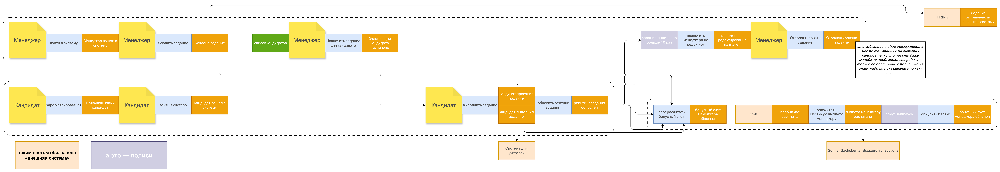
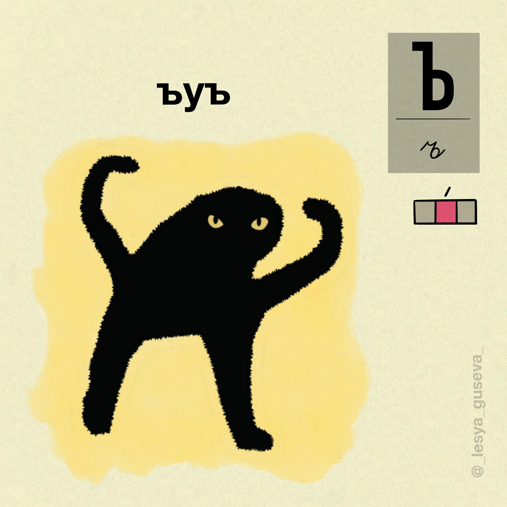

# Первая домашка

[ES диаграмма, покрупнее](es1.drawio.png), [оригинал в drawio](es1.drawio)

| No.                | Тек. связь                                                                                               | Как надо сделать                                                                                                                                                                     | Какие проб. решит                                                                                                    | Почему меняем                                                                                                                               |
| ------------------ | -------------------------------------------------------------------------------------------------------- | ------------------------------------------------------------------------------------------------------------------------------------------------------------------------------------ | -------------------------------------------------------------------------------------------------------------------- | ------------------------------------------------------------------------------------------------------------------------------------------- |
| COMM-010           | синхр. запрос менеджерских данных от сервиса заданий сервисом найма                                      | собственная модель менеджера в сервисе найма, обновление от сервиса заданий по CUD-событиям (стриминг)                                                                               | 010, 030, 080, 090                                                                                                   | сейчас на каждую операцию синхронный HTTP вызов, это плохо тем, что вызывает кучу тормозов и проблемы с доступностью из-за зависимости      |
| COMM-070, COMM-080 | синхр. запрос менеджерских данных от сервиса заданий сервисом расчетов, синхр. запрос зачисления средств | собственная модель менеджера в сервисе расчетов, обновление от сервиса заданий по CUD-событиям (стриминг)                                                                            | 040, 060, 080, 090                                                                                                   | сейчас на каждую операцию синхронный HTTP вызов, это плохо тем, что вызывает кучу тормозов и проблемы с доступностью из-за зависимости      |
| COMM-040           | синхровызов списания из найма в расчет                                                                   | заменить на событие «выполнено задание» с подробностями че за задание, кто, куда, чекаво, рейтинг задания посчитанный и т.д., сервис расчета примет свое решение о балансе исходя из | 010, 020, 030, 040, 050, 060, 070, 080, 090 и 010 косвенно... я сам в шоке чето если честно, но выходит, что так =)  | синхровызовы во первых тут control coupling, во-вторых, замыкают сервисы, роняя fault tolerance и performance (наверняка и другие -ilities) |
| COMM-050           | синхровызов зачисления из найма в расчет                                                                 | заменить на событие «выполнено задание» с подробностями че за задание, кто, куда, чекаво, рейтинг задания посчитанный и т.д., сервис расчета примет свое решение о балансе исходя из | 010, 020, 030, 040, 050, 060, 070, 080, 090  и 010 косвенно... я сам в шоке чето если честно, но выходит, что так =) | см. выше                                                                                                                                    |
| COMM-060           | асинк TaskRating                                                                                         | убираем в пользу события «выполнено задание»                                                                                                                                         | 100                                                                                                                  | кажется, тут решение 100 проблемы, т.к. видимо расчет рейтинга надеется висит на сервисе расчетов                                           |

## Мемы

