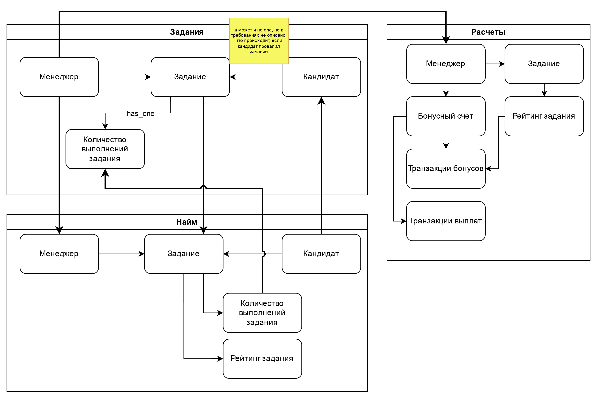

# Вторая домашка

[Концептуальная модель](conceptual.drawio.png), [оригинал в drawio](conceptual.drawio)

| No.                | Тек. связь                                                                                               | Как 1 урок                                                                                                                                                                                                  | Как 2 урок | Какие проб. решит                                                                                                    | Почему меняем                                                                                                                                           |
| ------------------ | -------------------------------------------------------------------------------------------------------- | ----------------------------------------------------------------------------------------------------------------------------------------------------------------------------------------------------------- | ---------- | -------------------------------------------------------------------------------------------------------------------- | ------------------------------------------------------------------------------------------------------------------------------------------------------- |
| COMM-010           | синхр. запрос менеджерских данных от сервиса заданий сервисом найма                                      | собственная модель менеджера в сервисе найма, обновление от сервиса заданий по CUD-событиям (стриминг)                                                                                                      |            | 010, 030, 080, 090                                                                                                   | сейчас на каждую операцию синхронный HTTP вызов, это плохо тем, что вызывает кучу тормозов и проблемы с доступностью из-за зависимости                  |
| COMM-070, COMM-080 | синхр. запрос менеджерских данных от сервиса заданий сервисом расчетов, синхр. запрос зачисления средств | собственная модель менеджера в сервисе расчетов, обновление от сервиса заданий по CUD-событиям (стриминг)                                                                                                   |            | 040, 060, 080, 090                                                                                                   | сейчас на каждую операцию синхронный HTTP вызов, это плохо тем, что вызывает кучу тормозов и проблемы с доступностью из-за зависимости                  |
| COMM-040           | синхровызов списания из найма в расчет                                                                   | заменить на событие «выполнено задание» с подробностями че за задание, кто, куда, чекаво, рейтинг задания посчитанный и т.д., сервис расчета примет свое решение о балансе исходя из                        |            | 010, 020, 030, 040, 050, 060, 070, 080, 090 и 100 косвенно... я сам в шоке чето если честно, но выходит, что так =)  | синхровызовы во первых тут control coupling, во-вторых, замыкают сервисы, роняя fault tolerance и performance (наверняка и другие -ilities)             |
| COMM-050           | синхровызов зачисления из найма в расчет                                                                 | заменить на событие «выполнено задание» с подробностями че за задание, кто, куда, чекаво, рейтинг задания посчитанный и т.д., сервис расчета примет свое решение о балансе исходя из                        |            | 010, 020, 030, 040, 050, 060, 070, 080, 090  и 100 косвенно... я сам в шоке чето если честно, но выходит, что так =) | см. выше                                                                                                                                                |
| COMM-060           | асинк TaskRating                                                                                         | убираем в пользу события «выполнено задание»                                                                                                                                                                |            | 100                                                                                                                  | кажется, тут решение 100 проблемы, т.к. видимо расчет рейтинга надеется висит на сервисе расчетов                                                       |
| COMM-030           | синхронный вызов назначения менеджера на переделку из найма в задания                                    | убираем в пользу событий о достижении порога выполнения задания                                                                                                                                             |            | 020, 030, 040, 050, 060, 070, 080                                                                                    | эта связь мешает сервисам функционировать независимо                                                                                                    |
| COMM-020           | синхронное получение инфо о задании для сервиса найма                                                    | полностью на самом деле убирать не нужно, на мой взгляд, может оказаться, что задание в событии слишком тяжелое, поэтому тут CUD-ивент с информацией о том, что нужно подтянуть задание синхронно, так вижу |            | 020, 060, 040, 080, 100 вероятно                                                                                     | вероятно, каждый раз при назначении задания либо старте выполнения подтягивается задание через эту связь, поэтому меняем ее на синхронизацию по событию |

| Топик | Названия событий и номера связи,  что будут в топике | Почему события попали в этот топик | Почему топик назван именно так |
| ----- | ------------------------------------------------------- | ---------------------------------- | ------------------------------ |
|       |                                                         |                                    |                                |
