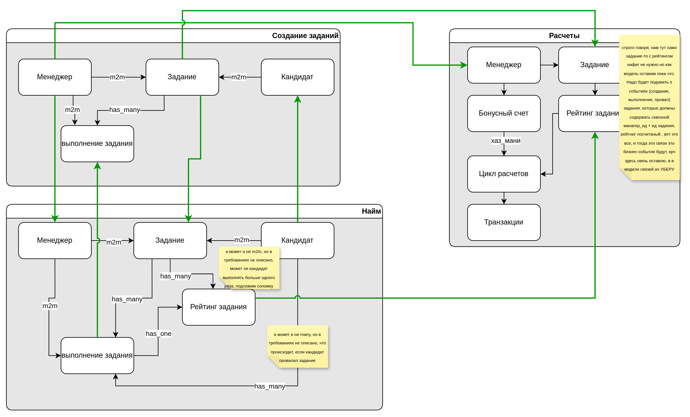
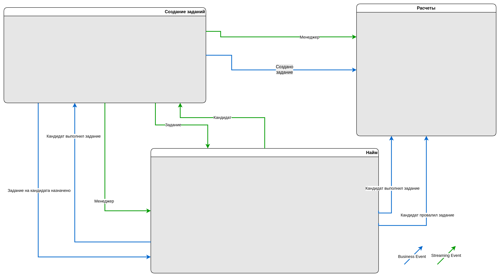
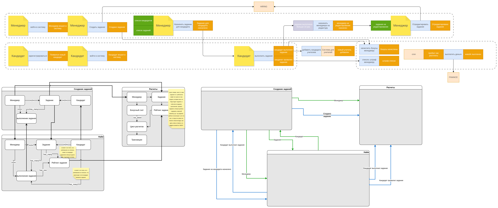
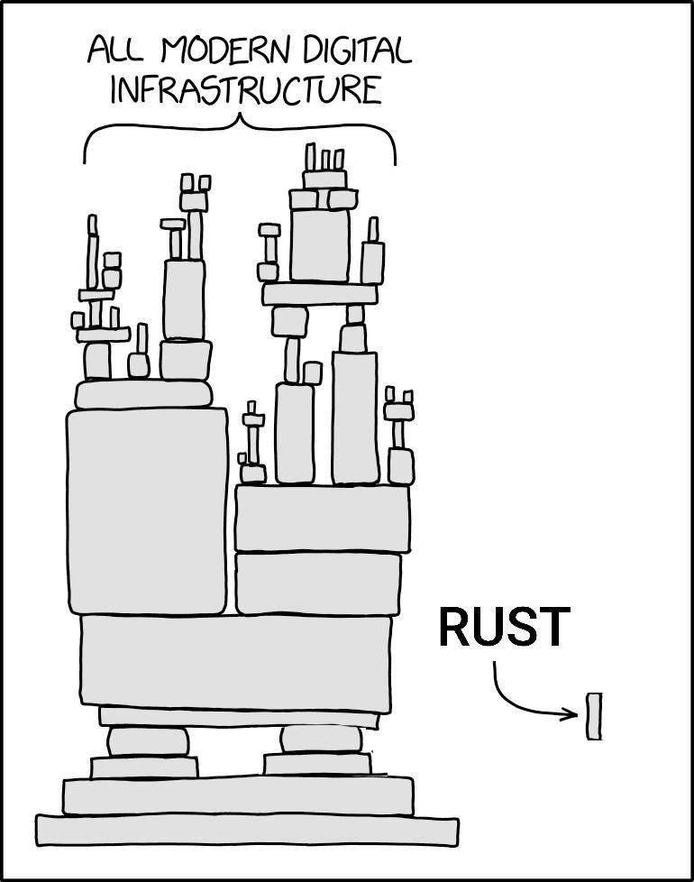

# Вторая домашка

### Концептуальная модель

[Концептуальная модель покрупнее](assets/conceptual.drawio.png) ([оригинал в drawio](all.drawio))

### Модель коммуникаций

[Модель коммуникаций покрупнее](assets/communications.drawio.png) ([оригинал в drawio](all.drawio))

### Все вместе

Все вместе

[Все вместе покрупнее](assets/all.drawio.png) ([оригинал в drawio](all.drawio))

## Связи

| No.      | Тек. связь                                                             | Как 1 урок                                                                                                                                                                                                  | Как 2 урок                                                                                                                                                                      | Какие проб. решит                                          | Почему меняем                                                                                                                                           |
| -------- | ---------------------------------------------------------------------- | ----------------------------------------------------------------------------------------------------------------------------------------------------------------------------------------------------------- | ------------------------------------------------------------------------------------------------------------------------------------------------------------------------------- | ---------------------------------------------------------- | ------------------------------------------------------------------------------------------------------------------------------------------------------- |
| COMM-010 | синхр. запрос менеджерских данных от сервиса заданий сервисом найма    | собственная модель менеджера в сервисе найма, обновление от сервиса заданий по CUD-событиям (стриминг)                                                                                                      | связь меняется с синх. на асинхр                                                                                                                                                | 010, 030, 080, 090                                         | сейчас на каждую операцию синхронный HTTP вызов, это плохо тем, что вызывает кучу тормозов и проблемы с доступностью из-за зависимости                  |
| COMM-020 | синхронное получение инфо о задании для сервиса найма                  | полностью на самом деле убирать не нужно, на мой взгляд, может оказаться, что задание в событии слишком тяжелое, поэтому тут CUD-ивент с информацией о том, что нужно подтянуть задание синхронно, так вижу | Ну здесь я как-будто угадал, только вот тут имеет смысл сделать event-notification, ибо мы не знаем размера «задания» (ну вот есть наши уроки, которые в курсе, они масштабные) | 020, 060, 040, 080, 100 вероятно                           | вероятно, каждый раз при назначении задания либо старте выполнения подтягивается задание через эту связь, поэтому меняем ее на синхронизацию по событию |
| COMM-030 | синхронный вызов назначения менеджера на переделку из найма в задания  | убираем в пользу событий о достижении порога выполнения задания                                                                                                                                             | бизнес-событие «задание выполнено», асинк, по нему будет приниматься решение (инк счетчика в сервисе заданий)                                                                   | 020, 030, 040, 050, 060, 070, 080                          | эта связь мешает сервисам функционировать независимо                                                                                                    |
| COMM-040 | синхровызов списания из найма в расчет                                 | заменить на событие «выполнено задание» с подробностями че за задание, кто, куда, чекаво, рейтинг задания посчитанный и т.д., сервис расчета примет свое решение о балансе исходя из                        | здесь все так же, как и в первой домашке                                                                                                                                        | 010, 020, 030, 040, 050, 060, 070, 080, 090 и 100 косвенно | синхровызовы во первых тут control coupling, во-вторых, замыкают сервисы, роняя fault tolerance и performance (наверняка и другие -ilities)             |
| COMM-050 | синхровызов зачисления из найма в расчет                               | заменить на событие «выполнено задание» с подробностями че за задание, кто, куда, чекаво, рейтинг задания посчитанный и т.д., сервис расчета примет свое решение о балансе исходя из                        | здесь все так же, как и в первой домашке, только не «выполнено задание», а «провалено задание, логика списаний на сервисе расчетов                                              | 010, 020, 030, 040, 050, 060, 070, 080, 090  и 100         | см. выше                                                                                                                                                |
| COMM-060 | асинк TaskRating                                                       | убираем в пользу события «выполнено задание»                                                                                                                                                                | убираем, эта информация будет частью бизнес-события о выполнении задания                                                                                                        | 100                                                        | кажется, тут решение 100 проблемы, т.к. видимо расчет рейтинга надеется висит на сервисе расчетов                                                       |
| COMM-070 | синхр. запрос менеджерских данных от сервиса заданий сервисом расчетов | собственная модель менеджера в сервисе расчетов, обновление от сервиса заданий по CUD-событиям (стриминг)                                                                                                   | асинк стриминг, да                                                                                                                                                              | 040, 060, 080, 090                                         | сейчас на каждую операцию синхронный HTTP вызов, это плохо тем, что вызывает кучу тормозов и проблемы с доступностью из-за зависимости                  |
| COMM-080 | синхр. запрос зачисления средств                                       | -                                                                                                                                                                                                           | событие «создано задание» будет вызывать логику зачислений в сервисе расчетов асинк                                                                                          | 40, 060, 080, 090                                          | декаплинг по сервисам, повышаем reliability и вообще                                                                                                    |
|          |                                                                        |                                                                                                                                                                                                             |                                                                                                                                                                                 |                                                            |                                                                                                                                                         |

## Топики

Так-с. У нас следующие сущности, которые стримятся:
- Задание
- Кандидат
- Менеджер

Далее, контексты, я их вижу тут условно два:
- Выполнение задания кандидатом
- Управления заданием от менеджера
Итого, сделаем три топика на «формализьм» и два на бизнес-ивенты.

Для стриминга я использую ~~стоп-~~ слово `datarep` в качестве неймспейса

Для бизнес-событий не будем сочинять, ns будет `domain`:

| Топик                         | Названия событий и номера связи,  что будут в топике                          | Почему события попали в этот топик | Почему топик назван именно так |
| ----------------------------- | -------------------------------------------------------------------------------- | ---------------------------------- | ------------------------------ |
| `datarep.excercise`           | COMM-020                                                                         | описал в тексте выше               | описал в тексте выше           |
| `datarep.candidate`           | COMM-090                                                                         | описал в тексте выше               | описал в тексте выше           |
| `datarep.manager`             | COMM-010, COMM-070                                                               | описал в тексте выше               | описал в тексте выше           |
| `domain.excercise_management` | Задание создано, задание на кадидата назначено, COMM-080, COMM-090               | описал в тексте выше               | описал в тексте выше           |
| `domain.candidate_attempt`    | Задание выполнено, задание провалено, COMM-030, COMM-040, COMM-050, COMM-060  | описал в тексте выше               | описал в тексте выше           |

## Мемы

