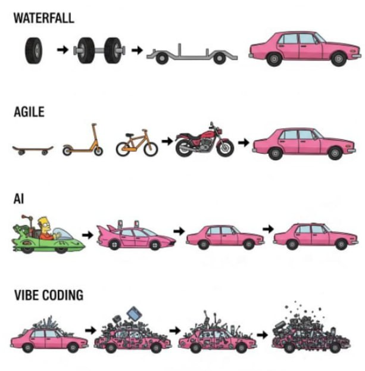
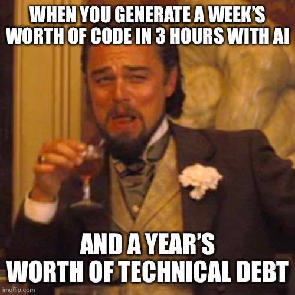

# Третья домашка

## Схемы событий

### Функциональное событие: Задание выполнено

```json
{
  "$defs": {
    "ExerciseCompleted": {
      "description": "Exercise completed event payload",
      "properties": {
        "exercise_id": {
          "title": "Exercise Id",
          "type": "string"
        },
        "title": {
          "title": "Title",
          "type": "string"
        },
        "author_id": {
          "title": "Author Id",
          "type": "string"
        },
        "candidate_id": {
          "title": "Candidate Id",
          "type": "string"
        },
        "completed_at": {
          "title": "Completed At",
          "type": "string"
        }
      },
      "required": [
        "exercise_id",
        "title",
        "author_id",
        "candidate_id",
        "completed_at"
      ],
      "title": "ExerciseCompleted",
      "type": "object"
    }
  },
  "description": "Initial json schema for exercise completed event",
  "properties": {
    "event_id": {
      "title": "Event Id",
      "type": "string"
    },
    "event_version": {
      "const": 0,
      "title": "Event Version",
      "type": "integer"
    },
    "event_name": {
      "const": "ExerciseCompleted",
      "title": "Event Name",
      "type": "string"
    },
    "produced_at": {
      "title": "Produced At",
      "type": "string"
    },
    "payload": {
      "$ref": "#/$defs/ExerciseCompleted"
    }
  },
  "required": [
    "event_id",
    "event_version",
    "event_name",
    "produced_at",
    "payload"
  ],
  "title": "ExerciseCompletedEnvelope",
  "type": "object"
}
```

### Формальное событие: Стриминг задания

Схема для стриминга state CUD-события (C в данном случае):

```json
{
  "description": "ExerciseCreated payload",
  "properties": {
    "exercise_id": {
      "title": "Exercise Id",
      "type": "string"
    },
    "title": {
      "title": "Title",
      "type": "string"
    },
    "content": {
      "title": "Content",
      "type": "string"
    },
    "author_id": {
      "title": "Author Id",
      "type": "string"
    },
    "created_at": {
      "title": "Created At",
      "type": "string"
    },
    "updated_at": {
      "anyOf": [
        {
          "type": "string"
        },
        {
          "type": "null"
        }
      ],
      "default": null,
      "title": "Updated At"
    }
  },
  "required": [
    "exercise_id",
    "title",
    "content",
    "author_id",
    "created_at"
  ],
  "title": "ExerciseCreated",
  "type": "object"
}
```

## Процессы миграции

### Sync -> ED Async (form)

Процитируем второй урок:


| No.      | Тек. связь                                                             | Как 1 урок                                                                                                                                                                                                  | Как 2 урок                                                                                                                                                                      | Какие проб. решит                                          | Почему меняем                                                                                                                                           |
| -------- | ---------------------------------------------------------------------- | ----------------------------------------------------------------------------------------------------------------------------------------------------------------------------------------------------------- | ------------------------------------------------------------------------------------------------------------------------------------------------------------------------------- | ---------------------------------------------------------- | ------------------------------------------------------------------------------------------------------------------------------------------------------- |
| COMM-020 | синхронное получение инфо о задании для сервиса найма                  | полностью на самом деле убирать не нужно, на мой взгляд, может оказаться, что задание в событии слишком тяжелое, поэтому тут CUD-ивент с информацией о том, что нужно подтянуть задание синхронно, так вижу | Ну здесь я как-будто угадал, только вот тут имеет смысл сделать event-notification, ибо мы не знаем размера «задания» (ну вот есть наши уроки, которые в курсе, они масштабные) | 020, 060, 040, 080, 100 вероятно                           | вероятно, каждый раз при назначении задания либо старте выполнения подтягивается задание через эту связь, поэтому меняем ее на синхронизацию по событию |

И выбранный нейминг для топика:

| Топик                         | Названия событий и номера связи, <br>что будут в топике                          | Почему события попали в этот топик | Почему топик назван именно так |
| ----------------------------- | -------------------------------------------------------------------------------- | ---------------------------------- | ------------------------------ |
| `datarep.excercise`           | COMM-020                                                                         | описал в тексте выше               | описал в тексте выше           |


1. Создадим topic `datarep.exercise`
2. Создадим schema registry.
3. [Опишем схему](#формальное-событие-стриминг-задания), добавим в schema registry
4. Создадим консумер, добавим обработчик события.
5. Создадим продюсер на стороне источника, раскатим под FF [^1]
6. Убедимся, что это работает, отправив события из продюсера.
7. Переключим на асинхронную коммуникацию.
8. Очистим код от синхронного вызова

### ED Async -> Sync (form)

Представим, что нужно сделать ровно [наоборот](#sync---ed-async-form) =)

1. Создадим API endpoint `/api/v0/exercise`
2. Создадим логику вызова со стороны потребления (это у нас **pull-процессинг**)
3. Убедимся, что это работает
4. Переключим на синхронную коммуникацию логику сервиса.
5. Погасим продьюсер.
6. После исчерпания топика, погасим консумеры.

### Sync -> ED Async (func)

Вернемся к табличкам для [связи](#функциональное-событие-задание-выполнено):

| No.      | Тек. связь                                                             | Как 1 урок                                                                                                                                                                                                  | Как 2 урок                                                                                                                                                                      | Какие проб. решит                                          | Почему меняем                                                                                                                                           |
| -------- | ---------------------------------------------------------------------- | ----------------------------------------------------------------------------------------------------------------------------------------------------------------------------------------------------------- | ------------------------------------------------------------------------------------------------------------------------------------------------------------------------------- | ---------------------------------------------------------- | ------------------------------------------------------------------------------------------------------------------------------------------------------- |
| COMM-030 | синхронный вызов назначения менеджера на переделку из найма в задания  | убираем в пользу событий о достижении порога выполнения задания                                                                                                                                             | бизнес-событие «задание выполнено», асинк, по нему будет приниматься решение (инк счетчика в сервисе заданий)                                                                   | 020, 030, 040, 050, 060, 070, 080                          | эта связь мешает сервисам функционировать независимо                                                                                                    |

***

| Топик                         | Названия событий и номера связи, <br>что будут в топике                          | Почему события попали в этот топик | Почему топик назван именно так |
| ----------------------------- | -------------------------------------------------------------------------------- | ---------------------------------- | ------------------------------ |
| `domain.candidate_attempt`    | Задание выполнено, задание провалено, COMM-030,<br>COMM-040, COMM-050, COMM-060  | описал в тексте выше               | описал в тексте выше           |

1. Создадим topic `domain.candidate_attempt`
2. Создадим schema registry. (если еще не)
3. [Опишем схему](#формальное-событие-стриминг-задания), добавим в schema registry
4. Создадим консумер, добавим обработчик события с бизнес логикой.
5. Создадим продюсер на стороне источника, раскатим под FF [^1]
6. Убедимся, что это работает, отправив события из продюсера.
7. Переключим на асинхронную коммуникацию.
8. Очистим код от синхронной коммуникации.


### ED Async -> Sync (func)

Представим, что нужно сделать ровно [наоборот](#sync---ed-async-func) =)

1. Создадим API endpoint `/api/v0/assign_manager` в **сервисе заданий**
2. Создадим логику вызова со стороны **сервиса найма**
3. Убедимся, что все работает в новой схеме.
4. Переключим на синхронную коммуникацию логику сервиса.
5. Погасим продьюсер.
6. После исчерпания топика, погасим консумеры.


## Миграция по новым требованиям

### US-160

Функциональная коммуникаци о выполнении задания из **заданий** в **найм**:

0. Создадим schema regisry, если еще нет, заведем туда старую схему события
1. Опишем новую схему, с `knowlegde_area`, загрузим в registry
2. Добавим в консумер на стороне **найма** новый обработчик под версию.
3. Добавим nullable поле `knowlegde_area` в БД.
4. Проведем миграцию БД.
5. Добавим в продюсера поддержку новой версии схемы.
6. Проверим, что все работает, отправив новую версию события под FF [^1]
8. Переключаем полностью продюсер на новую схему
9. Дожидаемся поглощения всех событий из старой схемы
10. Отключаем старые обработчики на стороне **найма**
11. Мигрируем БД, делая `knowlegde_area` non-nullable в **найме**, кроме того, пишем бекфилл на миграцию старых данных в БД. (ну вот так хочу =)
12. Чистим консумер от старой логики
13. Чистим систему от старого события.


### US-170

Формальная связь с менеджером из **заданий** в **найм**

0. Создадим schema regisry, если еще нет, заведем туда старую схему события с персданными менеджера
1. Опишем новую схему, без персданных, загрузим в registry
2. Добавим в консумер на стороне **найма** новый обработчик под версию.
3. Пометим поля с персданными nullable в БД.
4. Проведем миграцию БД.
5. Чистим логику (где могло показывать из БД данные).
6. Добавим в продюсера поддержку новой версии схемы.
7. Проверим, что все работает, отправив новую версию события под FF [^1]
8. Переключаем полностью продюсер на новую схему
9. Дожидаемся поглощения всех событий из старой схемы
10. Отключаем старые обработчики на стороне **найма**
11. Мигрируем БД, удаляя поля с персданными из **найма**
12. Чистим консумер от старой логики
13. Чистим систему от старого события.


## Проблемы зачисления/списания
Для решения проблем вокруг зачислений и списаний бонусов применим:

- используем тот факт, что у нас есть гарантии ордеринга на стороне кафки в рамках партишена (который один, и топик один)

- идемпотентность отправки событий, для чего добавим в события о выполнении/провале заданий `produced_at` и по паре id события и ts, будем понимать, было ли обработано событие или нет, чтобы избежать задвоений

- Для решения технических проблем с отправкой, воспользуемся **Transactional Outbox** + **Exponential Backoff**

- Для решения потенциальных проблем на стороне консумера, заведем **DLQ с ручным разбором**


[^1]: Feature Flag


## Мемы






