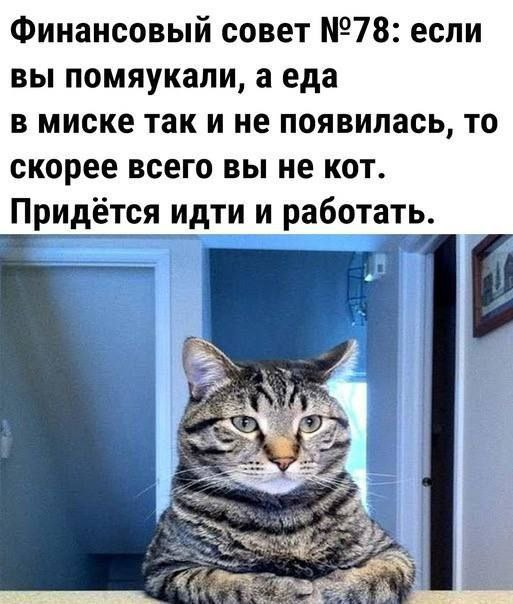
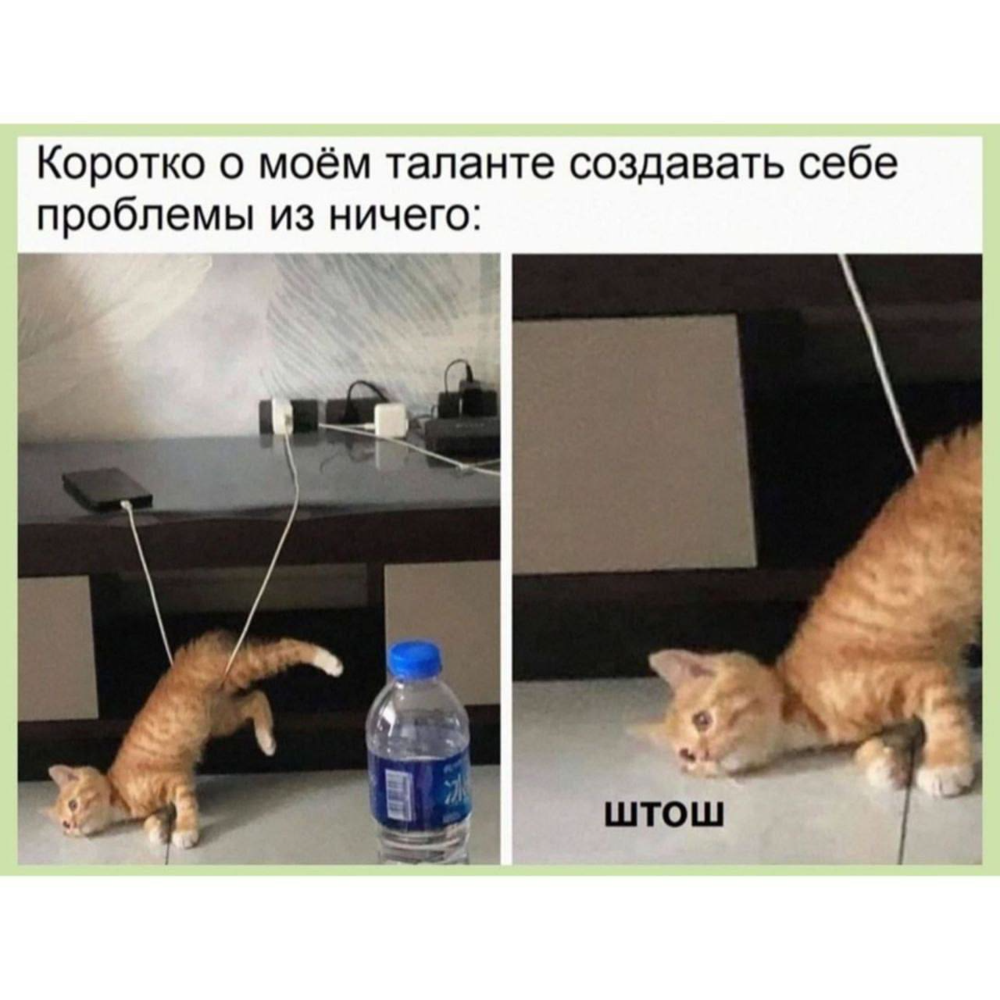
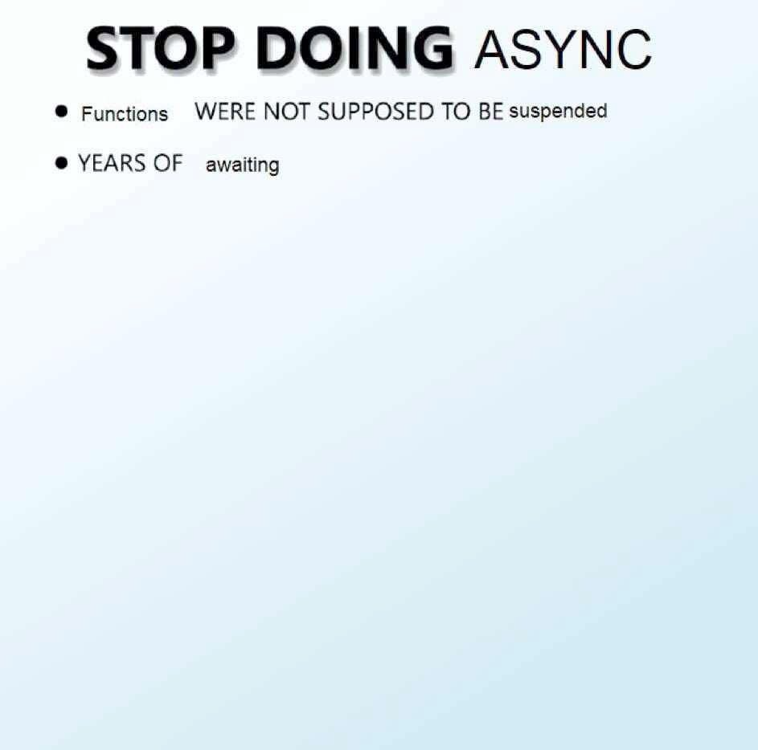
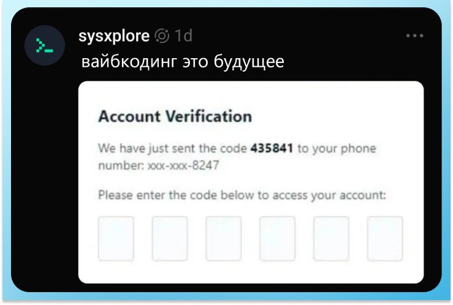

# Четвертая домашка

# ADR
## ADR.001 — миграция синхронного получения инфо о задании наймом `[COMM-020]`
### Status: Proposed
### Context
На момент принятия решения о синхросвязи, планировалось получать данные о задании в момент старта выполнения задания кандидатом.

Такое решение виделось оптимальным ввиду сроков и уровня компетенций внешней команды попугов.

Однако, решение быстро привело к проблемам из-за высокого каплинга (репорты `[Problem-060]`, `[Problem-080]`, `[Problem-090]`)
### Decision
Провести миграцию связи `[COMM-020]` на асинхронный формат, создать в БД найма собственное хранилище заданий, получаемых стриммингом из заданий.
### Consequences
Данные будут приходить асинхронно, что развяжет сервисы между собой, что, в свою очередь, позволит улучшить maintainability, performance и как следствие TTM.

# Почему возникли проблемы

## Список проблем, которые возникли у бизнеса

- `[Problem-010]` Долго определяется правильность выполнения задания от кандидата. Это вызывает задержки, которые бесят менеджеров и кандидатов в учителя.
- `[Problem-020]` Кандидаты в учителя читерят систему в месте, где простое задание должно усложниться, но этого ещё не произошло. Для этого они собираются в группы, где делятся лёгкими заданиями между собой, и, пока задание обновляется, пачкой выполняют лёгкие версии.
- `[Problem-030]` Логика начисления бонусов некорректна из-за ошибки с рейтингом задания. Во время начисления бонусов во время изменения рейтинга, происходит задержка, которая не удовлетворяет бизнес (нужно моментально).
- `[Problem-040]` Медленно начисляются бонусы менеджерам, потому что много кандидатов в учителя. Иногда вся система падает и не восстанавливается.
- `[Problem-050]` В UI может отобразиться ошибка каких-то запросов после успешного выполнения задания. Разработчики объясняют это поведение вызовом сервиса оплаты и создания заданий.
- `[Problem-060]` Нужно сократить расходы на скейлинг сервиса заданий. Сейчас дорого.
- `[Problem-070]` Менеджерам иногда начисляются бонусы дважды. Это связано с тем, что, когда кандидаты в учителя отправляют то же самое задание повторно, система тупит (`[Problem-050]`). Разработчики объясняют тем, что управление заданиями падает, а бонусами — нет. Из-за этого бонусы попадают в два одинаковых запроса.
- `[Problem-080]` Упавший сервис создания заданий или бонусов кладёт всю систему, и кандидаты в учителя не могут выполнять задания.
- `[Problem-090]` Фичи выходят слишком медленно. Это связано с тем, что для выполнения любой фичи нужно изучить всю систему и проверить, что ничего не упало. Короче, разработчики сами не понимают, как работает система вне отдельного сервиса.
- `[Problem-100]` Данные теряются вокруг логики выполнения заданий кандидатами в учителя.

| Название проблемы | Из-за чего возникла                                                                                                                                                                                                  | Как проблема решилась                                                                                                                                       |
| ----------------- | -------------------------------------------------------------------------------------------------------------------------------------------------------------------------------------------------------------------- | ----------------------------------------------------------------------------------------------------------------------------------------------------------- |
| Problem-010       | Найм по итогу выполнения делает минимум два из четрырех синхровызовов в процессе проверки: COMM-010, 030, 040 и 050 (плюс еще порождает 060, но это асинхронное событие). Это приводит задержкам в процессе проверки | Связи были заменены на асинхронные                                                                                                                          |
| Problem-020       | Из-за синхросвязи COMM-030 — каплинг                                                                                                                                                                                 | Замена на пару связей — асинк бизнес-связь с реакцией на стороне заданий на обновление, и прямая синхросвязь при обновлении задания стримингом сразу в найм |
| Problem-030       | связь COMM-060 выполена некорректно, она не должна быть асинхронной                                                                                                                                                  | Замена синхронный push в расчет бонусов                                                                                                                     |
| Problem-040       | COMM-040 + COMM-050: командный каплинг                                                                                                                                                                               | Замена на реакционных подход с асинк связями: теперь расчет бонусов — дело только сервиса расчета                                                           |
| Problem-050       | Дело в куче синхровызовов по выполнении задания: 040/050 + 030                                                                                                                                                       | Все вызовы изменены на асинхронные (за искл. обновления рейтинга)                                                                                           |
| Problem-060       | COMM-070, 010, 030                                                                                                                                                                                                   | Отвязка заданий от синхровызовов (pull) вообще                                                                                                              |
| Problem-070       | COMM-040/050                                                                                                                                                                                                         | Сделана идемпотентность + замена связей                                                                                                                     |
| Problem-080       | Синхросвязи                                                                                                                                                                                                          | Убраны синхросвязи (обновленное задание не ломает найм)                                                                                                     |
| Problem-090       | Общий каплинг между элементами + особенно командный каплинг                                                                                                                                                          | Замена связей на асинк                                                                                                                                      |
| Problem-100       | Синхросвязи                                                                                                                                                                                                          | Убрали синхросвязи                                                                                                                                          |

# Мемы

